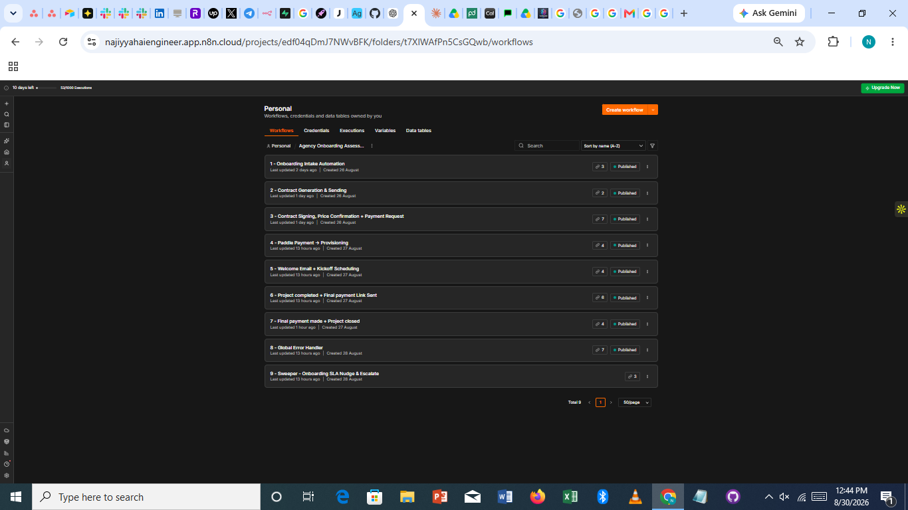
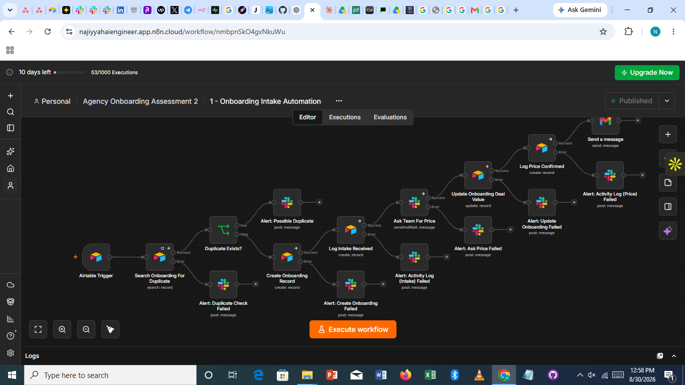
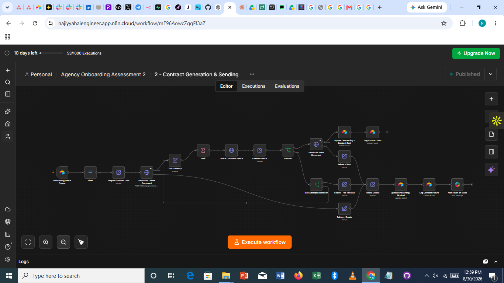
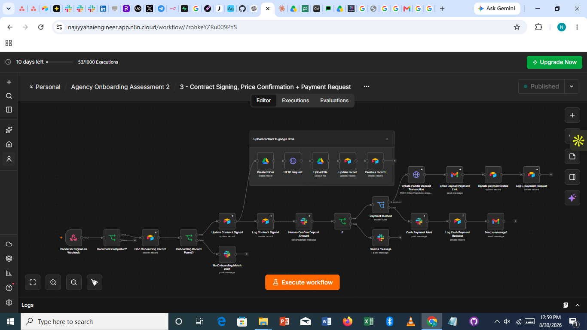
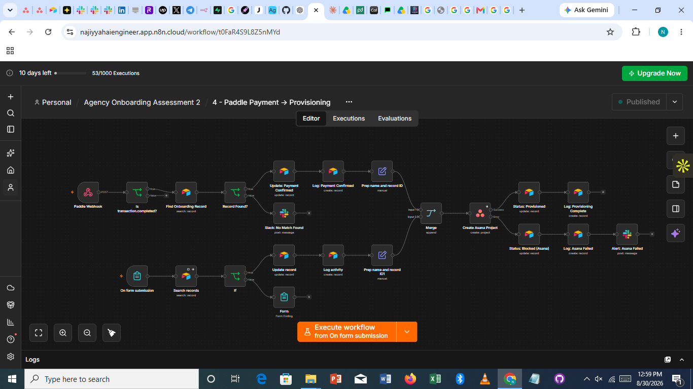
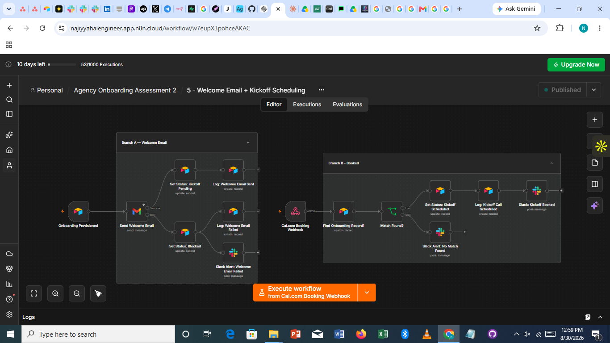
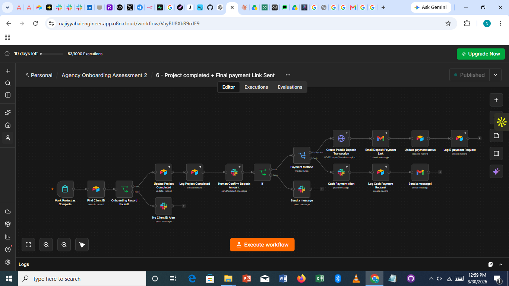
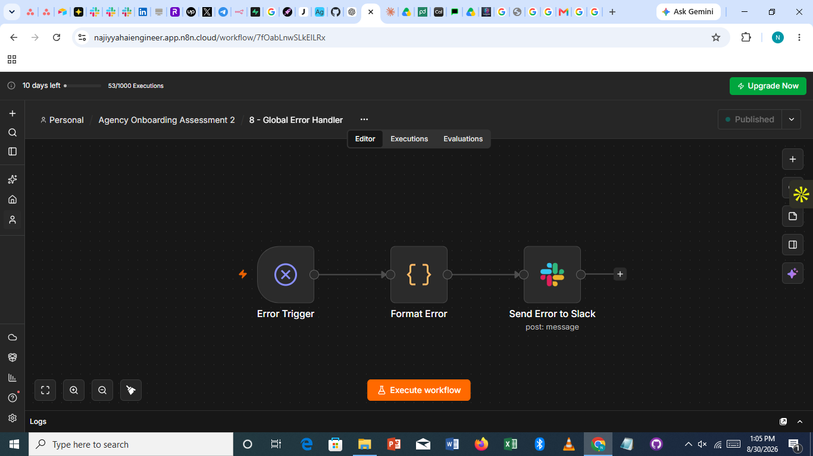
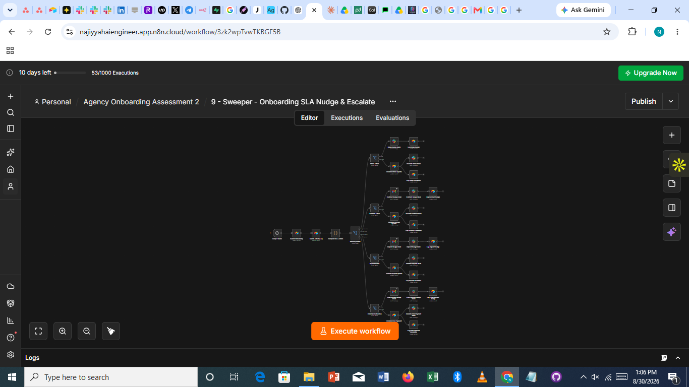

# Architecture and Technical Notes

This is the detailed companion to the README, covering the revised system built after agency feedback. It exists so that months from now, without memory of building this, you can open this file and reconstruct exactly how each piece works, not just what it does.

This document assumes familiarity with the general patterns already established in the first version: the create-then-log pairing, search-then-branch matching, and "Continue (using error output)" on external calls. What follows focuses on what is new or different here.


---

## Data model changes

### Onboarding table
No longer created from a linked Deal. Created directly from an Intake Data submission.

- **Deal Value** — written directly by workflow 1 after a team member confirms it through Slack, not a lookup from a linked Deal.
- **Deposit Amount** — a formula field, half of Deal Value. Read directly by workflow 3's confirmation step, no Code node needed.
- **Remaining Balance** — a formula field, Deal Value minus Deposit Amount. Read directly by workflow 6's confirmation step.
- **Final Payment Amount** — written after the team confirms the remaining balance figure in workflow 6.
- **Payment Method** — single select, E-payment or Cash. Drives every Switch node branching decision from workflow 3 onward.
- **PandaDoc Document ID** — still used to match the signature webhook back to the correct record, and now also doubles as the reference number emailed to clients paying by cash, since it is already a unique identifier generated per client.

### Intake Data table
Now the actual entry point of the system. Fields cover only what is needed to create a record and generate a contract; deeper operational detail is deliberately not collected here.

---

## Workflow 1: Onboarding Intake Automation

- **Trigger:** Airtable Trigger on Intake Data, record created.
- **Duplicate check:** Airtable Search on Onboarding:
```
{Contact Email} = "{{ $json.fields['Contact Email'] }}"
```
- On no match: create the Onboarding record, Status set to Intake Received, log to Activity Log.
- **Pricing step:** a Slack node using n8n's `sendAndWait` operation. The message includes Client Name and project context; the node pauses execution until a reply is captured.
- On response: Airtable Update writes the confirmed number into Deal Value, Status moves to Price Confirmed, which triggers workflow 2.
- Every step from Search onward has a paired Slack error alert.

---

## Workflow 2: Contract Generation & Sending


Structurally unchanged from the first version's contract workflow. The trigger condition is now Status equals Price Confirmed instead of Deal Won, and Deal Value is read directly off the Onboarding record. The PandaDoc polling loop, token mapping, and native Google Docs template all carry over unchanged.

---

## Workflow 3: Contract Signing, Price Confirmation & Payment Request


- **Trigger:** Webhook, POST, Authentication None.
- **Match logic:** unchanged, matching on PandaDoc Document ID.
- **Drive upload:** once matched and marked Contract Signed, a node group creates or locates the client's Drive folder, fetches the signed document via an HTTP request to PandaDoc, uploads it, and links it on the Onboarding record.
- **Deposit confirmation:** a `sendAndWait` Slack node, reading Deposit Amount directly from the formula field. The message includes total Deal Value alongside the 50 percent figure, so the confirmation checks the split and the client match, not the price itself, which was already settled at signature.
- **Payment Method branch:**
  - **E-payment:** creates a Paddle transaction using the same non-catalog dynamic pricing pattern from the first version, using the confirmed Deposit Amount. Emails the client a payment link via Gmail.
  - **Cash:** emails the client their PandaDoc Document ID as a reference number, posts an internal Slack alert that a cash payment is expected.
- Both branches log to Activity Log, noting the method used.

---

## Workflow 4: Paddle Payment → Provisioning


This workflow has two independent trigger nodes sitting on the same canvas, converging on one shared path. It is the result of merging what was originally a card-only provisioning trigger with a standalone cash confirmation form, once it became clear a cash-paying client had no automated route into provisioning at all.

- **Path A — card:** Paddle Webhook, POST, Authentication None. Filters on transaction.completed. Matches to the Onboarding record via `Find Onboarding Record`.
- **Path B — cash:** Form Trigger (`On form submission`). The client enters the reference number they were emailed. `Search records` checks it against Onboarding; the IF node either confirms (true) or ends the form with a re-entry message (false).
- Both paths independently update the record and log "Payment Confirmed," then each runs a small "Prep name and record ID" Set node, standardizing the data shape so the next step does not need to know which path it came from.
- **Merge node**, Append mode, two inputs, one per path. Whichever path actually ran is the one that reaches Merge; the other simply never fires for that execution.
- **After the merge:** creates the Asana project for the client. The Drive folder is not created here, since it already exists from workflow 3.
- On success: Status to Provisioned, log to Activity Log.
- On Asana failure: Status to Blocked (Asana), log, Slack alert.

**Why this merge matters structurally:** without it, a card-paying client and a cash-paying client would need two entirely separate provisioning workflows, identical except for their trigger, meaning any future change to provisioning logic would need to be made twice, with the risk of the two copies drifting apart. The Merge node makes payment method irrelevant past this one point.

---

## Workflow 5: Welcome Email & Kickoff Scheduling


Unchanged from the first version. Two independent triggers: Branch A on Status equals Provisioned sending the welcome email, Branch B listening for a Cal.com booking webhook.

---

## Workflow 6: Project Completed & Final Payment Request


Mirrors workflow 3's structure, triggered differently and using the remaining balance instead of the deposit.

- **Trigger:** Form Trigger, "Mark Project as Complete," submitted by a project lead.
- **Match:** Airtable Search on Onboarding by Client Name.
- On match: Status to Project Complete, log to Activity Log.
- **Confirmation:** a `sendAndWait` Slack node reading Remaining Balance directly from its formula field.
- **Payment Method branch:** identical structure to workflow 3.

---

## Workflow 7: Final Payment Made & Project Closed


Same convergence pattern as workflow 4: a Paddle webhook path and a cash confirmation form path (a second form, separate from workflow 4's, confirming the final payment rather than the deposit) both feed into the same shared closing logic, updating Status to Closed and logging the final Activity Log entry. This workflow already had this merge from the start; the gap that needed fixing only existed on the deposit side, in what became workflow 4.

---

## Workflow 8: Global Error Handler


A standalone workflow: an Error Trigger node, which n8n automatically calls whenever another workflow fails in a way not otherwise caught inside it, a Code node formatting the incoming error data, and a Slack node posting it.

Every other workflow has this one selected under its own Settings tab, under Error Workflow. Explicit error branches that also update Status to a specific Blocked reason are kept in place separately, since the global handler only knows something failed, not what business-specific status change should follow.

---

## Workflow 9: The Sweeper


Monitors:

- **Intake Received** (internal: the team has not yet confirmed a price) — shorter thresholds, since this is entirely within the agency's own control
- **Contract Sent** (client-facing: waiting on signature)
- **Deposit Awaiting Payment** (client-facing: waiting on either payment method)
- **Final Payment Awaiting Payment** (client-facing: waiting on either payment method)

Internal-facing nudges route to Slack only. Client-facing nudges route to Gmail for the client and Slack for internal visibility. The dedup logic from the first version, checking Activity Log for an existing "Nudge Sent" entry matching this client and stage before sending another, carries over unchanged.

---

## A mistake worth remembering in detail

The first version, during a live demo, was left with all workflows active afterward. The Onboarding table's trigger used a formula field as a workaround since Airtable's native trigger options did not behave as expected in n8n. That same field was also updated by the workflow's own status-change actions.

The result was a loop: the trigger polled, saw the formula field's value differ, ran the workflow, the workflow changed the record's status, which changed the formula field's value again, the next poll saw another difference, and ran again. A new contract was generated and sent, and a new Activity Log entry written, on every one of those repeated runs. The same test record was processed well over a hundred times before this was noticed.

The first version had a duplicate-prevention check on record creation, matching Client Name and Status before creating a new Onboarding record. It had no equivalent check on contract sending itself, so once the loop started, nothing stopped repeated sends against the same, already-existing record.

Two changes came out of this: avoid triggering a workflow off any field that workflow itself writes to, unless a separate, one-time-only condition is also checked; and add a duplicate-action guard to every workflow step that sends something externally, not only the steps that create new records.
